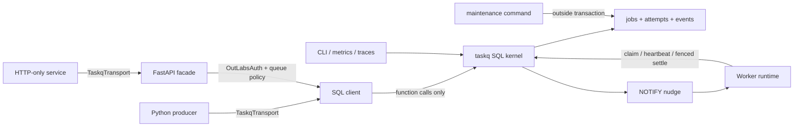

# Product and architecture proposal

## North star

OutLabs TaskQ is a Postgres-native durable task queue for Python services. It gives a small FastAPI service a five-minute path from function to durable task while preserving the control, visibility, and migration safety needed by larger systems.

The product promise is:

> If TaskQ accepts a task, PostgreSQL durably owns it. A worker may execute it more than once after failure, but only the current fenced attempt may change its state, and accepted work is never silently discarded.

This is deliberately narrower and more credible than “Postgres message bus.” TaskQ provides at-least-once task execution, scheduling, retries, and composition. It is not pub/sub, a log/stream-platform replacement, or a general event stream. Applications needing mailbox semantics can use the Postgres message-queue extension beside it; applications needing fan-out/event retention can use an outbox or an event system beside it.

## Product principles

1. **Tiny happy path.** Define a typed task, call `.enqueue()`, run a worker.
2. **PostgreSQL owns correctness.** Claiming, leases, fencing, budgets, and transitions live in SQL functions.
3. **Typed uncertainty.** Conflicts and replays are values such as `created`, `existed`, `locked`, or `lost`, never an unexplained `None`.
4. **One protocol, multiple topologies.** Direct SQL and authenticated HTTP expose the same commands and outcomes.
5. **Transactions are a feature.** A task can commit atomically with the application's own data.
6. **Secure by construction.** Applications get function capabilities, not table DML; queue-level policy uses authoritative database metadata.
7. **Operationally boring.** Bounded queries, predictable polling, visible backlog/lease health, no required broker or control plane.
8. **Progressive power.** Advanced policies are reachable without making every user understand them.

## The user experience

### Install and define a task

```bash
pip install outlabs-taskq
taskq migrate "$DATABASE_URL"
```

```python
from pydantic import BaseModel, EmailStr
from taskq import RetryPolicy, TaskQ


class SendWelcome(BaseModel):
    user_id: str
    email: EmailStr


taskq = TaskQ(database_url=settings.database_url)


@taskq.task(
    queue="email",
    input=SendWelcome,
    retry=RetryPolicy(max_failures=8),
)
async def send_welcome(payload: SendWelcome) -> None:
    await mailer.send_welcome(payload.email)
```

### Enqueue normally or inside an application transaction

```python
result = await send_welcome.enqueue(
    SendWelcome(user_id=user.id, email=user.email),
    key=f"welcome:{user.id}",
)

if result.created:
    logger.info("welcome queued", extra={"job_id": str(result.job_id)})
```

```python
async with session.begin():
    user = User(...)
    session.add(user)
    result = await send_welcome.enqueue(
        SendWelcome(user_id=user.id, email=user.email),
        key=f"welcome:{user.id}",
        transaction=session,
    )
```

The second form is the central Postgres advantage: either the user and task commit, or neither does.

### Run workers

```bash
taskq worker myapp.tasks:taskq --queues email --concurrency 8
```

Or embed deliberately in a FastAPI lifespan for a small deployment:

```python
from contextlib import asynccontextmanager
from fastapi import FastAPI
from taskq.fastapi import TaskqRuntime

runtime = TaskqRuntime(taskq, queues=["email"], concurrency=2)


@asynccontextmanager
async def lifespan(app: FastAPI):
    async with existing_runtime(app), runtime(app):
        yield


app = FastAPI(lifespan=lifespan)
```

The runtime must support synchronous handlers by moving them to a bounded worker thread pool. It must never block the ASGI event loop.

## Progressive configuration

Power should appear in layers:

| Level | Intended user | Configuration |
|---|---|---|
| Convention | Most tasks | Queue name; safe lease/retry/poll defaults |
| Queue profile | Service owner | Concurrency, lease, heartbeat, retry, priority, retention |
| Task definition | Task author | Input/output type, timeout, retry override, concurrency-key extractor |
| Enqueue call | Producer | Idempotency key, run time, priority, metadata, transaction |
| Operator policy | Platform/operator | Pause, drain, redrive, archive, maintenance, credential scope |

Every effective value should be inspectable with `taskq config explain <queue> [task]`, including its source. There should be no hidden merge behavior.

## Architecture



### TaskQ Core

- ordered SQL migrations in the fixed `taskq` schema;
- queue, job, attempt, event, worker-presence, and migration metadata;
- enqueue/claim/heartbeat/settle/control functions;
- the Python task registry and direct SQL transport;
- a worker supervisor with graceful drain and lease-aware shutdown;
- CLI commands: `migrate`, `verify`, `worker`, `inspect`, `drain`, `retry`, `redrive`, `maintenance`;
- safe operational functions and views.

### TaskQ Integrations

- `taskq.fastapi`: router, dependency, runtime, health/readiness, HTTP transport;
- `taskq.outlabs`: permission catalog, authorizer, role/service-token helpers;
- SQLAlchemy transaction adaptation;
- Prometheus and OpenTelemetry adapters;
- test fixtures and optional Testcontainers support.

### TaskQ Advanced

- cron schedules with explicit backfill policy;
- dependencies, workflow inspection, and lossless follow-ups;
- additional uniqueness policies;
- archive partition management and advanced retention;
- optional rate/resource admission controls if workloads prove the need;
- read-only diagnostics/MCP after the CLI JSON contract is stable.

Core must import and run without FastAPI or OutLabsAuth installed. Integration imports should fail with a useful extras message rather than failing at `import taskq`.

## Public Python contracts

### Typed task identity

`Task[InputT, OutputT]` is the unit shared by producer and worker. It carries a stable wire name, payload schema version, queue, and execution policy. The function's Python import path is not the wire identity; refactors may change modules without orphaning queued jobs.

Task definitions should support explicit aliases during a rename:

```python
@taskq.task(
    name="accounts.send_welcome",
    aliases=["users.send_welcome_v1"],
    queue="email",
    input=SendWelcome,
    schema_version=2,
)
async def send_welcome(payload: SendWelcome) -> None:
    ...
```

Payload conversion should happen through versioned upcasters before handler invocation. Unknown task names or unsupported payload versions fail visibly; they are not retried forever as transient infrastructure errors.

### `EnqueueResult`

The stable result is a discriminated union, not optional job data:

```text
Created(job_id, queue, task_name, scheduled_at)
Existed(job_id, queue, task_name, status)
Locked(key, retry_after)
Rejected(code, detail)
```

The first release needs `Created`, `Existed`, and a small stable rejection vocabulary. `Locked` becomes necessary if later uniqueness modes take advisory locks. Exception classes are reserved for unavailable transport, protocol incompatibility, or programmer error.

### Handler results

Handlers may return:

```text
Complete(output=None, followups=[])
Retry(error, delay=None)
Snooze(until|delay, reason=None)
Cancel(reason)
```

Returning `None` is shorthand for `Complete()`. Raising a normal exception maps to `Retry`; a declared non-retryable exception maps to terminal failure. Each result is converted to a fenced settlement command using the current `attempt_id` and `worker_id`.

The `followups` field is reserved in the typed model but non-empty follow-ups are a `0.2` capability. A `0.1` worker must reject them clearly rather than ignore them.

### Resource injection

TaskQ should inject application resources by type or stable name without adopting a large middleware system:

```python
@taskq.task(queue="email", input=SendWelcome)
async def send_welcome(payload: SendWelcome, mailer: Mailer) -> None:
    ...

runtime = TaskqRuntime(taskq, resources={Mailer: mailer})
```

Resource lifetimes belong to the host lifespan/runtime. TaskQ does not construct arbitrary application dependencies or serialize them into jobs.

## SQL kernel contracts

The current unified design's core invariants should remain:

- the database clock decides visibility and lease expiry;
- claim uses `FOR UPDATE SKIP LOCKED` and changes job/attempt ownership atomically;
- every running attempt has a unique random fence token;
- only the current fence can heartbeat or settle;
- failure budget is different from claim count;
- release/snooze do not consume a failure budget;
- expired leases are recovered without allowing an old worker to settle;
- a notification is only a nudge; polling guarantees progress;
- no application role writes queue tables directly.

The kernel should expose stable domain outcome codes. Python maps records to typed results; it must not reimplement state-transition decisions.

## Transport protocol

Define a small internal `TaskqTransport` protocol around domain commands:

```text
enqueue
claim
heartbeat
complete
fail
release
snooze
cancel_running
get_job
list_jobs
control_queue
```

The direct transport calls SQL functions. The HTTP transport calls the FastAPI facade. Both use the same Pydantic request/outcome models and pass the same conformance suite.

Do not try to make PostgreSQL, Redis, RabbitMQ, or SQS interchangeable backends. The Postgres transaction and fencing model is the product. The transport abstraction is for deployment boundaries, not storage portability.

## Versioned HTTP surface

The exact path style is an ADR, but it should be consistent and versioned from day one. A command-oriented surface maps cleanly to the SQL kernel:

```text
POST /taskq/v1/queues/{queue}/jobs
POST /taskq/v1/queues/{queue}/claims
POST /taskq/v1/jobs/{job_id}/heartbeats
POST /taskq/v1/jobs/{job_id}/complete
POST /taskq/v1/jobs/{job_id}/fail
POST /taskq/v1/jobs/{job_id}/release
POST /taskq/v1/jobs/{job_id}/snooze
POST /taskq/v1/jobs/{job_id}/cancel-running
GET  /taskq/v1/jobs/{job_id}
GET  /taskq/v1/queues/{queue}/jobs
```

Enqueue returns `202 Accepted` with a typed result. A replayed successful settlement returns a normal typed `already_settled` result. A lost fence returns `409` with code `attempt_lost`. Authentication failures are `401`; policy failures are `403`; caller assertions that conflict with authoritative job metadata are `409` or `422` according to the frozen protocol.

Attempt fences must never appear in general job reads, list results, metrics labels, or logs. They are capabilities carried only by the worker claim/settle channel.

## Compatibility with existing systems

| System | Recommended topology | Migration method |
|---|---|---|
| outlabsAPI | Embedded runtime for dogfood, then dedicated worker if load grows | Replace local execution with registered tasks while keeping host lifespan composition explicit |
| QDarte | Synchronous HTTP client to a TaskQ facade; no database credentials | Compatibility service preserves existing task API, then moves callers to the typed TaskQ client |
| Diverse | Existing FastAPI facade evolves to the versioned protocol; dedicated worker fleet | Shadow/dual-read validation, canary queues, then per-lane cutover |
| New FastAPI service | Direct SQL for transactional enqueue; dedicated worker by default | Install extra, include router only if remote producers need it |
| Restricted/external producer | HTTP transport with queue-scoped OutLabsAuth credential | Same `EnqueueResult`; no library-specific branching in application logic |

Compatibility shims that mirror an old application's route or payload belong in that host repository, not in TaskQ Core.

## Release capabilities

### `0.1` — trustworthy kernel and delightful single-task path

- secure install/verify/migrate;
- typed tasks, queue profiles, SQL/HTTP transports;
- lease/fence/retry/poison kernel and worker runtime;
- idempotent enqueue with reject/existed semantics;
- pause/resume/retry/redrive and safe inspection;
- FastAPI and OutLabsAuth integrations;
- metrics/traces plus correctness, security, and benchmark harnesses.

### `0.2` — composition and automation

- schedules and explicit backfill;
- lossless follow-ups, dependencies, workflow views;
- completion handles/watchers;
- additional uniqueness policies whose transitions are fully specified;
- richer payload evolution and resource injection.

### `0.3` — scale and operations

- partitioned archive and retention automation;
- advanced DLQ routing if proven necessary;
- validated rate/resource admission controls;
- read-only diagnostic API/MCP;
- PostgreSQL-version-specific optimizations behind capability detection.

Release labels describe capability maturity, not deadlines. A feature moves earlier only if its invariants, security tests, transport conformance, operations, and migration story are complete.

## What “amazing” means here

The differentiator is not the largest feature list. It is the combination of:

- transaction-native enqueue;
- an API that feels like ordinary typed Python;
- database-enforced worker correctness;
- HTTP and SQL parity for mixed estates;
- queue-scoped authorization that works with OutLabsAuth out of the box;
- failure messages and operational views that explain exactly what happened;
- a reproducible harness that lets every new optimization prove it preserved correctness.

That combination is both easier to adopt and harder to outgrow than a kitchen-sink first release.
